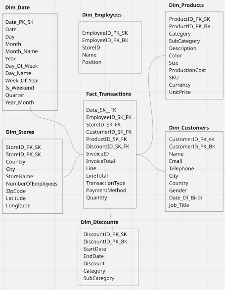
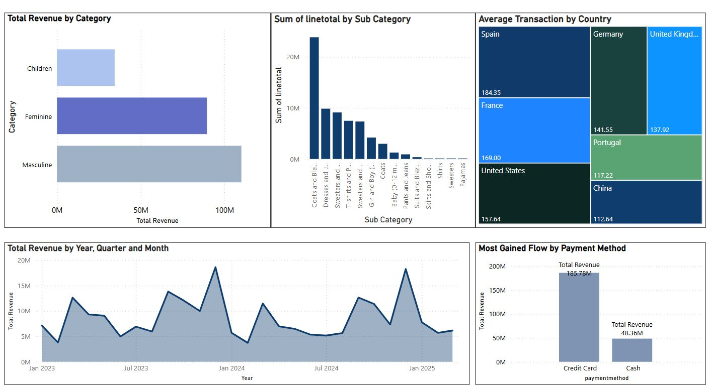

# 🛠️ DE Project: End-to-End Data Engineering Pipeline

## 🚀 Overview

This project focuses on building a **complete Data Engineering (DE) pipeline**, starting from raw source data ingestion, through ETL (Extract, Transform, Load) processing, **data modeling** into a data warehouse, and finally **visualization** and reporting.

It demonstrates how to build a robust, production-ready pipeline, following industry best practices.

---

## 🏗️ Project Architecture

- **Orchestration**: Apache Airflow (Astro CLI)
- **Processing**: Apache Spark (PySpark jobs)
- **Storage**: Amazon S3 (Landing Zone / Data Lake)
- **Validation**: Great Expectations (GX)
- **Data Warehouse**: Amazon Redshift Serverless
- **Monitoring & Alerts**: Slack Webhooks
- **Visualization**: Power BI

---

## 🛤️ Pipeline Flow


The project ingests structured data from two primary sources: a PostgreSQL transactional database and CSV files.

1. **Source Data Ingestion**:  
   - Extract structured CSV files and ingest them into Amazon S3 (Landing Zone).
   - Extract normalized transactional data from a PostgreSQL database.

2. **ETL Processing**:  
   - Execute PySpark jobs to clean, transform, and enrich the ingested data.
   - Perform necessary joins, aggregations, and type conversions.

3. **Data Validation**:  
   - Apply Great Expectations validations on processed datasets to ensure schema, completeness, and quality.

4. **Data Modeling**:  
   - Design a **Star Schema** by transforming normalized transactional data into a fully **denormalized** analytical schema, optimized for reporting and querying.

5. **Data Warehouse Loading**:  
   - Load validated and modeled data into Amazon S3.
   - Automatically trigger an AWS Lambda function to `COPY` the data into Redshift Serverless, populating fact and dimension tables.

6. **Visualization**:  
   - Connect Power BI using **DirectQuery** to Amazon Redshift for real-time, live querying and visualization.

7. **Data Documentation and Quality Reports**:  
   - Generate automated static Data Quality and Validation Reports using Great Expectations.
   - Host the reports on a secured S3 bucket exposed through HTTPS using Amazon CloudFront.

8. **Orchestration and Monitoring**:  
   - Orchestrate the entire pipeline using Apache Airflow DAGs.
   - Configure Slack Webhook alerts to notify the data team on task failures or pipeline anomalies.

---

## 📂 Project Structure

```plaintext
airflow_project/
│
├── dags/                      # Airflow DAGs (Orchestration scripts)
│   └── production.py
│
├── include/                   
│   ├── spark_jobs/             # PySpark ETL scripts
│   ├── archive/                # Processed CSVs
│   └── gx/                     # Great Expectations configs and docs
│
├── plugins/                   # Airflow custom plugins (optional)
│
├── Dockerfile                  # Airflow Docker setup
├── requirements.txt            # Python dependencies
├── airflow_settings.yaml       # Astro project settings
└── README.md                   # This file
```
## Data Modelling 
The DWH is designed to be a denormaized DWH star Schema
The diagram:



## Data Validation automated reports you can access live on:


## Altering and Monitoring 
We Used Slack Webhooks to send automated notifications if tasks failed


## Data Visualization, Dashboard:


---


## Technologies Used

| Tool | Purpose |
|------|---------|
| Airflow | Task scheduling and orchestration |
| PySpark | Distributed data processing and ETL |
| S3 | Cloud storage for landing/processed data |
| AWS Lambda | Loading data automatically into redshift |
| Redshift | Data warehouse for analytics and reporting |
| Great Expectations | Data validation, documentation and reports |
| Slack | Real-time failure alerts |
| Astro CLI | Simplified local Airflow development |
| Power BI | Visualization |


---

## How to Run Locally

1. Clone the repo:

    ```bash
    git clone https://github.com/Amir380-A/Data-project.git
    cd de-project
    ```

2. Start Airflow locally using Astro CLI:

    ```bash
    astro dev start
    ```

3. Access the Airflow UI at:

    ```
    http://localhost:8080
    ```

4. (Optional) Submit Spark jobs manually inside the container if needed.

---
OR you can use airflow normally by

1. **Clone the repository**:

    ```bash
    git clone https://github.com/Amir380-A/Data-project.git
    cd your-repo
    ```

2. **Create and activate a virtual environment**:

    ```bash
    python3 -m venv .venv
    source .venv/bin/activate
    ```

3. **Install dependencies**:

    ```bash
    pip install -r requirements.txt
    ```

4. **Set up environment variables**:

    Create a `.env` file and add your configurations:

    ```bash
    touch .env
    ```

    Example `.env` content:

    ```env
    AWS_ACCESS_KEY_ID=your_access_key
    AWS_SECRET_ACCESS_KEY=your_secret_key
    REDSHIFT_CLUSTER_ID=your-cluster-id
    ```

5. **Run Airflow locally** (if you use Astronomer, for example):

    ```bash
    astro dev start
    ```

6. **Access Airflow UI**:

    - Open your browser and navigate to `http://localhost:8080`.
    - Default username: `admin`
    - Default password: `admin`


## Future Improvements

- Automate schema evolution using AWS Glue Schema Registry.
- Add streaming ingestion using Kafka and Spark Structured Streaming.
---

## References

- [Apache Airflow](https://airflow.apache.org/)
- [Apache Spark](https://spark.apache.org/)
- [Amazon Redshift](https://aws.amazon.com/redshift/)
- [Great Expectations](https://greatexpectations.io/)

---

## Acknowledgments

Built with passion for Data Engineering.


